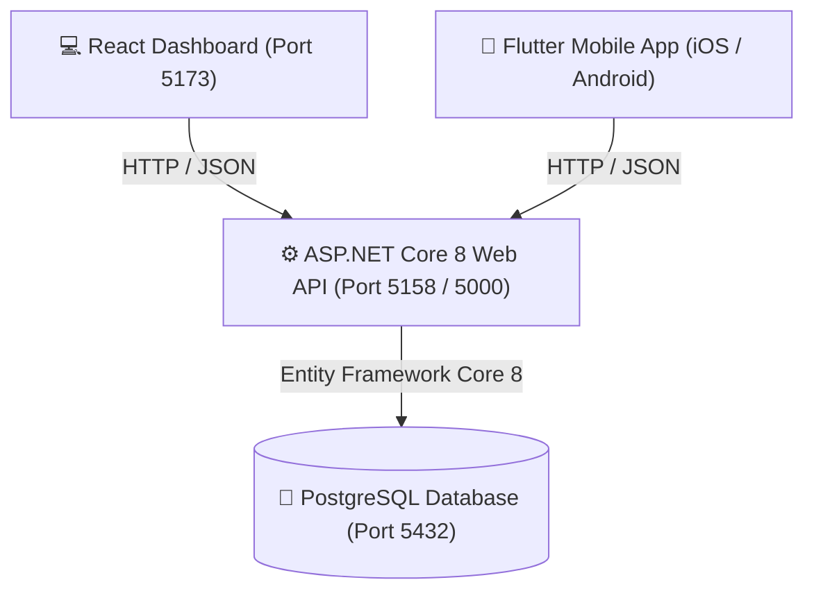

# 🍕 FoodDeliverySystem

A premium, multi-platform **Food Delivery System** built with a robust ASP.NET Core backend, a high-performance React frontend dashboard, and a sleek Flutter mobile client.

---

## 🚀 Tech Stack & Ecosystem


---

## 📐 System Architecture

The application implements a decoupled, API-first architecture ensuring high scalability, modularity, and rapid platform deployment.



---

## 📁 Repository Structure & Key Code References

The workspace is organized as a monorepo containing three core components:

```
FoodDeliverySystem/
├── backend/            # ASP.NET Core Web API Core Engine
├── frontend/           # React + Vite Web Client Dashboard
└── mobile/             # Flutter Mobile Cross-Platform Client
```

Below are direct workspace links to critical entrypoints:

*   **Backend Configuration & Routing**: [Program.cs](file:///c:/manamperi/New%20folder%20%283%29/FoodDeliverySystem/backend/Program.cs)
*   **Database Context & Seed Rules**: [FoodDeliveryDbContext.cs](file:///c:/manamperi/New%20folder%20%283%29/FoodDeliverySystem/backend/Data/FoodDeliveryDbContext.cs)
*   **Web Dashboard Portal**: [App.tsx](file:///c:/manamperi/New%20folder%20%283%29/FoodDeliverySystem/frontend/src/App.tsx)
*   **Mobile App Bootstrap**: [main.dart](file:///c:/manamperi/New%20folder%20%283%29/FoodDeliverySystem/mobile/lib/main.dart)
*   **Mobile API Services & Network Failover**: [api_service.dart](file:///c:/manamperi/New%20folder%20%283%29/FoodDeliverySystem/mobile/lib/api_service.dart)

---

## 🛠️ Getting Started & Setup

Follow these steps sequentially to configure your local development environment:

### Prerequisites
*   [.NET 8.0 SDK](https://dotnet.microsoft.com/download)
*   [Node.js (v18+)](https://nodejs.org/) & `npm`
*   [Flutter SDK (3.12+)](https://docs.flutter.dev/get-started/install)
*   [PostgreSQL (v14+)](https://www.postgresql.org/download/) database engine

---

### 💻 Step 1: Database Setup & Migrations

1. Ensure your PostgreSQL server is active and the connection configuration in [appsettings.json](file:///c:/manamperi/New%20folder%20%283%29/FoodDeliverySystem/backend/appsettings.json) matches your local credentials:
    ```json
    "ConnectionStrings": {
      "DefaultConnection": "Host=localhost;Database=FoodDeliveryDb;Username=postgres;Password=postgres"
    }
    ```
2. Navigate to the `backend` directory and apply EF Core migrations to instantiate database schemas and seed menu items:
    ```bash
    cd backend
    dotnet ef database update
    ```

> [!TIP]
> If you do not have the Entity Framework Core CLI tools installed globally, execute: `dotnet tool install --global dotnet-ef` before applying migrations.

---

### ⚙️ Step 2: Spin Up the ASP.NET Core Backend

Run the API service locally:
```bash
cd backend
dotnet run
```
The backend web service defaults to `http://localhost:5158` (or `http://localhost:5000` as a fallback). 
*   **API Swagger Documentation**: Visualized at `http://localhost:5158/` during development.

---

### 🖥️ Step 3: Run the React Dashboard Web App

1. Navigate to the `frontend` workspace directory.
2. Install package dependencies and boot the Vite server:
    ```bash
    cd frontend
    npm install
    ```
3. Run the development server:
    ```bash
    npm run dev
    ```
The web dashboard runs at `http://localhost:5173/` by default.

---

### 📱 Step 4: Run the Flutter Mobile Application

The Flutter application automatically resolves target ports for desktop environments, the iOS Simulator (`localhost`), and the Android Emulator (`10.0.2.2`).

1. Navigate to the `mobile` workspace directory.
2. Fetch package dependencies:
    ```bash
    cd mobile
    flutter pub get
    ```
3. Boot the application on your active simulator, emulator, or connected physical device:
    ```bash
    flutter run
    ```

> [!NOTE]
> Make sure that the backend API is running (`dotnet run`) before starting your client applications, as they query it immediately on load.

---

## 📡 Core API Endpoint Reference

| HTTP Method | Endpoint | Request Body | Response Payload | Description |
| :--- | :--- | :--- | :--- | :--- |
| **GET** | `/api/menuitems` | None | `Array<MenuItem>` | Fetches all available dishes and prices. |
| **GET** | `/api/orders` | None | `Array<Order>` | Retrieves all existing customer orders. |
| **POST** | `/api/orders` | `Order` (JSON) | `Order` (JSON) | Submits a new food order to the database. |

---

## 📂 Domain Entities Structure

### 🍕 MenuItem
Represents dishes on the restaurant's active menu catalog.
*   `Id` (int, Primary Key)
*   `Name` (string) — e.g., "Classic Cheeseburger"
*   `Description` (string) — Ingredient breakdown
*   `Price` (decimal) — USD unit cost
*   `IsAvailable` (boolean) — Stock state toggler

### 📦 Order
Tracks customer purchase logs and delivery states.
*   `Id` (int, Primary Key)
*   `CustomerId` (int) — Identifier for ordering users
*   `TotalAmount` (decimal) — Combined cost of all selected items
*   `Status` (string) — `Pending`, `Preparing`, `Delivered`
*   `Items` (List<MenuItem>) — Many-to-Many association containing ordered dishes
*   `DeliveryJob` (DeliveryJob) — Linked driver dispatch object

### 🚗 DeliveryJob
Tracks final-mile delivery status and dispatch assignments.
*   `Id` (int, Primary Key)
*   `OrderId` (int) — Foreign key linking directly to the [Order](file:///c:/manamperi/New%20folder%20%283%29/FoodDeliverySystem/backend/Models/Order.cs)
*   `DriverId` (int) — Assigned delivery personnel identity
*   `Status` (string) — `Assigned`, `In Transit`, `Completed`

---

> [!IMPORTANT]
> The default frontend client maps order requests to `CustomerId: 2`. All data mutations persist live directly to the target PostgreSQL instances.
